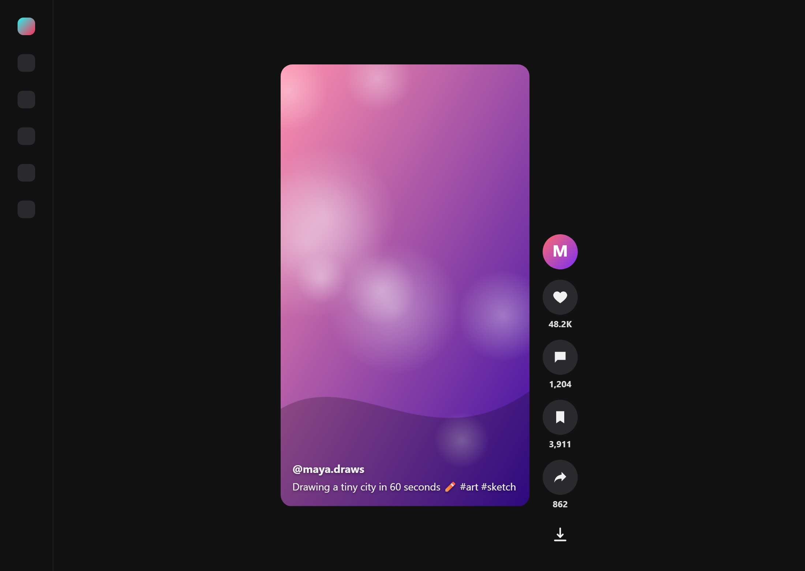
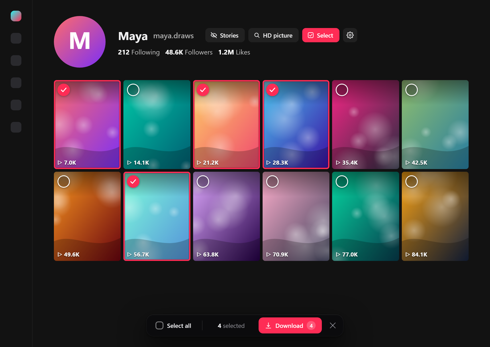
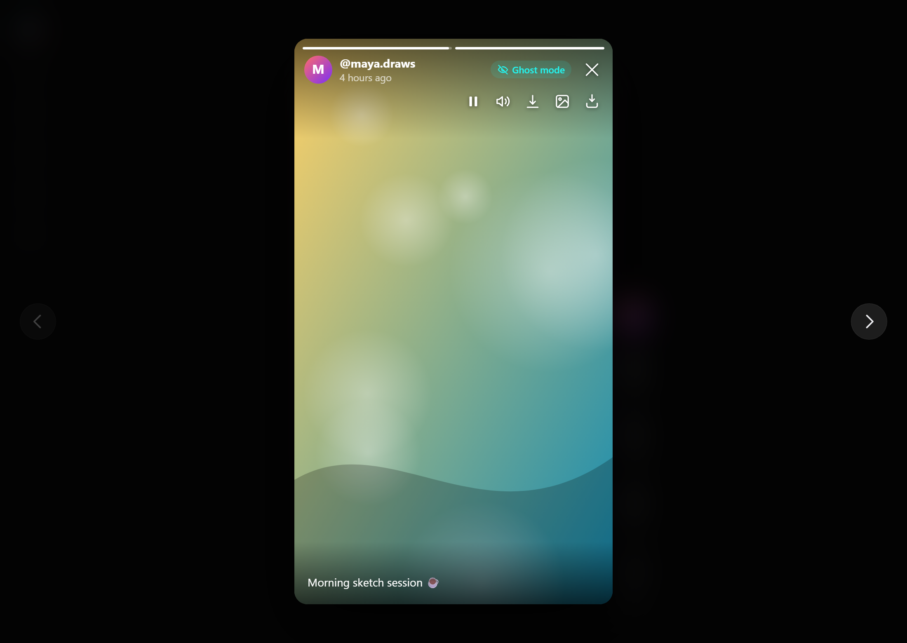
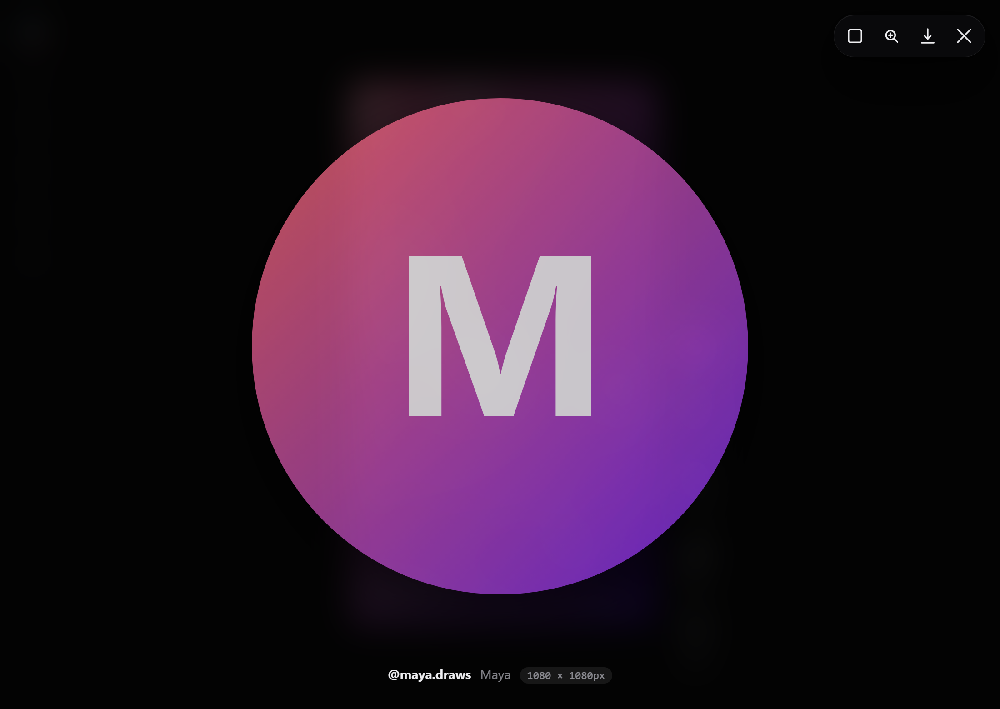
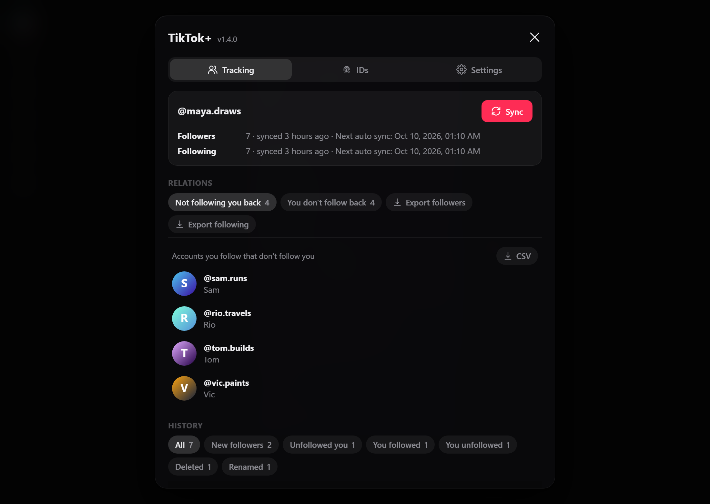
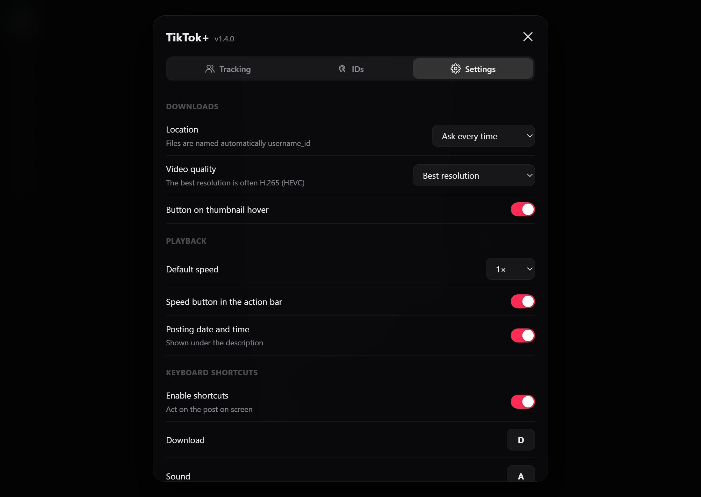

# TikTok+

A Chrome extension that adds the TikTok features I was missing: downloads without watermark, stories without being seen, HD profile pictures and follower tracking.

> Educational project, shared for code inspection: an example of a browser extension adding features a website doesn't offer. Not affiliated with TikTok. See [Notes](#notes).

| Ghost mode stories | HD profile picture |
| --- | --- |
|  |  |

| Followers & following | Settings |
| --- | --- |
|  |  |

*Screenshots use made-up demo accounts and images.*

## Features

**Downloads**
- Video without watermark, best quality (H.264 option in the settings)
- Photo posts: the photo on screen, all of them, or pick one
- Thumbnail, sound as MP3, full-resolution frame capture
- Button on thumbnail hover, and "Select" on a profile to download many posts at once
- Files named `username_id`, saved where you choose

**Stories**
- Ghost mode: watch stories without showing up in the viewers list
- Download one story or all of them
- Download button in TikTok's own story player too

**Profiles**
- HD profile pictures (1080×1080) with zoom
- Copy an account's permanent ID, mark it and find it again after an @ change

**Followers & following**
- History of new followers, unfollows, accounts you followed or unfollowed, deleted accounts and @ changes
- Who doesn't follow you back, who you don't follow back
- Auto sync every 12 h or 24 h, manual sync, CSV export

**Extras**
- Exact posting date, playback speed (0.5× to 2×)
- Shortcuts: D download, A sound, X capture; Alt+Shift+T opens the panel
- English and French

## Download

Get the zip from the [latest release](https://github.com/princzcsl/tiktok-plus/releases/latest) and unzip it. Then in Chrome:

1. Open `chrome://extensions` and turn on **Developer mode**
2. Click **Load unpacked** and pick the unzipped folder
3. Reload your TikTok tabs

To update, replace the folder with the new one and click the reload icon on the extension.

## Notes

- This repository is for educational purposes and code inspection. It is not a product and may break whenever TikTok changes its site.
- Not affiliated with, endorsed or sponsored by TikTok or ByteDance. Follow TikTok's Terms of Service and the law, respect creators, and only download what you're allowed to keep.
- Everything runs in your browser with your own session: no server, no tracking. Data stays in Chrome's local storage.

## License

[MIT](LICENSE)
